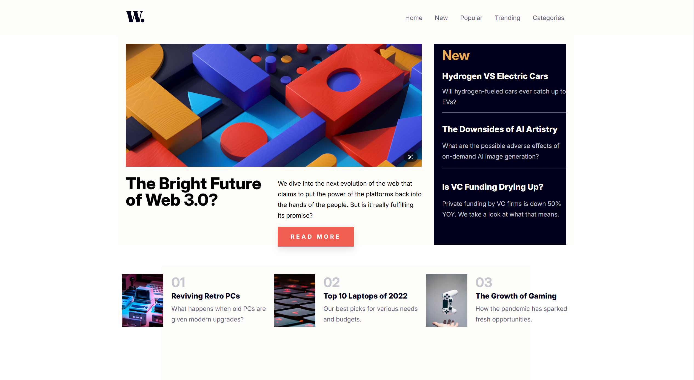

# Responsive-news-layout
## 📋 Project Overview

This project is a **responsive web layout** designed to practice and demonstrate the use of **CSS Flexbox** and **Grid**. The layout is inspired by a Figma design, aiming to replicate its structure and responsiveness across various devices.

## 🎯 Objectives

- Master the fundamentals of **CSS Flexbox** and **CSS Grid**.
- Create a fully **responsive design** adaptable to mobile, tablet, and desktop screens.
- Practice the integration of assets from Figma into a real-world web project.

## 🚀 Technologies Used

- **HTML5** for semantic structure
- **CSS3** with Flexbox and Grid for layout design
- **Responsive Design** principles
- **Font Awesome** for icons
- **Google Fonts** (Inter)

## 📱 Responsive Features

- **Mobile-First Approach**: Optimized for small screens first, then scaled up for larger devices.
- **Navigation Bar**: Includes a burger menu for smaller screens.
- **Flexible Layouts**: Content adjusts dynamically using Grid and Flex properties.

## 📸 Project Preview




## 📂 Project Structure

```
Flex-Grid-Responsive-Figma/
├── index.html
├── styles.css
└── assets/
    └── img/
        ├── W..svg
        ├── image-1.png
        ├── image-2.png
        ├── image-3.png
        └── image-4.png
```

## ⚙️ How to Run the Project

1. Clone the repository:
   ```bash
   git clone https://github.com/Fauve-mce/Flex-Grid-Responsive-Figma.git
   ```
2. Navigate to the project folder:
   ```bash
   cd Flex-Grid-Responsive-Figma
   ```
3. Open `index.html` in your preferred browser.

## 🌐 Live Demo

Check out the deployed version here: [Explore-Responsive-news-layout](https://fauve-mce.github.io/Responsive-news-layout/)

## 💡 Key Learnings

- Mastery of **Flexbox** and **Grid** for modern web layouts.
- Applying **responsive design** techniques effectively.
- Translating Figma designs into fully functional web pages.

